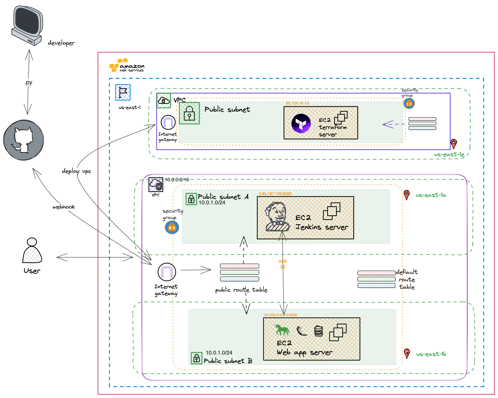
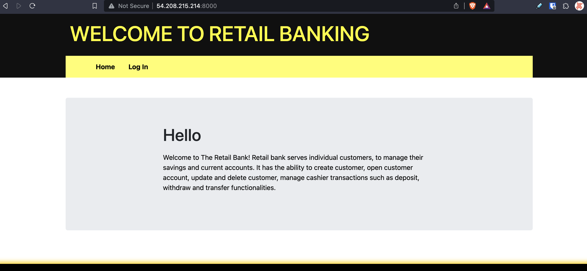

# Provisioning a virtual private cloud (VPC) that will 

***This is a guide to using some base line terraform code to deploy a virtual private cloud that hosts a Jenkins server along with a web server for a retail banking web application (Flask). The Jenkins server is used for a continuous integration and continuous delivery pipeline of the banking app.***

## VPC Architecture

- The vpc spans two availability zones (data centers) over the us-east-1 region (Virginia)
- Our internet gateway is the service that allows our vpc to connect to the public internet.
- The vpc has two public subnets. One in each availability zone. 
- The public subnets are used for the Jenkins server and the web server. Both the Jenkins server and the web application need to be accessible by the public internet. The Jenkins server has a webhook that is used to trigger a build of the web application when a change is made to the web application's github repository.
- Amazon creates a default route table for each vpc. We create a custom route table for our public subnets. The custom route table has a route that directs traffic to the internet gateway. The custom route table is associated with the public subnets.
- The security group is used for both public subnets. The security group allows inbound traffic on port 80, 8080, 8000 (http) and port 22 (ssh). The security group allows outbound traffic on all ports.



## Terraform

Terraform is central to this project and helps avoid the need to manually create and configure resources in AWS. With terraform we can define a resources like a vpc, subnet, security group, etc. in a .tf file. We can then run the terraform code to create the resources in AWS. 

A terraform project can be started with a simple init command
```bash
terraform init
```

Before we can create resources we need to provide authentication details to terraform. If the aws cli is installed and authenticated we can cat the credentials file to see the authentication details.
```bash
cat ~/.aws/credentials
```

It's possible to add the credential to a provider block but i've found it easier to use environment variables. The environment variables are set in the terminal session that terraform is run in
```bash
export AWS_ACCESS_KEY_ID="anaccesskey"
export AWS_SECRET_ACCESS_KEY="asecretkey"
```

As we are defining the resources we can to create in the cloud in a [.tf](./terraform/main.tf) we can validate that our code is syntactically correct by running a validate command.
```bash
terraform validate
```

Once we are happy with our code we can run a plan command to see what resources will be created in the cloud
```bash
terraform plan
```

If we are happy with the plan we can run an apply command to create the resources in the cloud
```bash
terraform apply
```

If we want to destroy the resources we can run a destroy command
```bash
terraform destroy
```

In terraform code for this deployment we added shell scripts to the user data of the Jenkins server and the web server. The shell scripts are used to install the required software on the servers. The shell scripts are run when the servers are created. The shell scripts are located in the [scripts](./terraform) directory.

With terraform a variables.tf file we can define variables like:
```terraform
variable "key-name" {
  default = "mykey"
}
```
This is helpful so that we can avoid pushing sensitive information like keys to github. We can then reference the variable in our code like:
```terraform
resource "aws_instance" "jenkins" {
  ami           = "ami-0dc2d3e4c0f9ebd18"
  instance_type = "t2.micro"
  key_name      = var.key-name
  ...
}
```

Be sure to include the variables.tf file in the [.gitignore](.gitignore) file so that the variables.tf file is not pushed to github.

## Github

Before you build the pipeline you'll need a Github token and use it on Jenkins so that it can pull the respository

- Navigate to your Github users setting
- Click on 'Developer Settings'
- Click on the 'Personal Access Tokens' dropdown and select 'Tokens (classic)'
- Click on the 'Generate new token' dropdown and select 'Generate new token (classic)
- Add an appropriate note like 'Jenkins Controller'
- You need full control of repo. (If you want to deploy with Jenkins select admin:repo_hook)
- SAVE THE TOKEN, you wont be presented with the token again

Add a webhook so that when we push to main it triggers a jenkins build

- Navigate to your repositories settings in Github
- Click on 'Webhook' and 'Add Webhook'
- Add {jenkins-server-ip:port}/github-webhook/. This comes with the Jenkins Github plugin

## Jenkins
Jenkins is installed and started by the script we pass to the user data of EC2 definition in our terraform code.

Once Jenkins is running we can access the Jenkins server by navigating to the public ip address of the Jenkins server in a web browser on port 8080.

We'll begin to build the pipeline. We are using a multibranch pipeline

- Retrieve admin password from /var/jenkins/secrets/initialAdminPassword
- Navigate to {public.ip}:8080 on your browser to configure the dashboard. You will be prompted for the admin password
- You will be prompted to install the recommended plugin or choose your own. Install the quick start jenkins plugins
- Install the'Pipeline Keep Running Step' plugin:

  - From your Jenkins dashboard navigate to Manage Jenkins > Manage Plugins and select the Available tab. Locate this plugin by searching for pipeline-keep-running-step.
- Navigate to 'New Item'
- Select Multibranch pipeline
- Name your pipeline
- You'll see an option called branch sources. Choose GitHub and enter your GitHub link and credentials.
- Under the Github section
- Click on 'Add' under the credential drop down, select Jenkins
- Click on the Kind dropdown select 'Username with password'
- Add your Github username to the username' field
- In the 'password' field add the GitHub token you generated
- Click 'Add'. The modal will close.
- You can now select your credential in the 'Credentials' dropdown
- In the 'Repository HTTPS URL' field add your repositories URL
- Remove all behaviors except 'Discover branches' and select 'all branches'

The scripts we pass to the user data of the EC2 definition for the the jenkins creates a user called 'jenkins' and adds the user to the sudo group. The scripts generates an ssh key pair that is used to ssh into the web server from the Jenkins server.

```bash
# create jenkins user with sudo privileges  
# -m flag to create user home, and -s to set the shell
sudo useradd -m -s /bin/bash jenkins
echo "jenkins:$jenkinspwd" | sudo chpasswd
sudo usermod -aG sudo jenkins

# login
sudo su - jenkins

# generate ssh keys for jenkins user. N flag is for empty password
ssh-keygen -t rsa -N "" -f ~/.ssh/id_rsa
```

To retrieve the public key login to the jenkins server and login to the jenkins user that owns the ssh keys and retrieve the public key 
```bash
sudo su - jenkins
cat /home/ubuntu/.ssh/id_rsa.pub
```

The public keys needs to be added to the authorized_keys file on the web server. Open the authorized_keys file on the web server and paste the public key in the file. The authorized_keys file is located at /home/ubuntu/.ssh/authorized_keys

Confirm that you can ssh into the web server from the Jenkins server. 
```bash
ssh ubuntu@{web-server-private-ip}
```

## Jenkinsfile

In the jenkins file we can use bash to ssh into the web server and deploy the web application. The scp command is used in the jenkins file to copy the setup.sh script onto the web server. The setup.sh script is then executed on the web server. The setup.sh script installs the required software on the web server and starts the web application.

```jenkinsfile
sh '''#!/bin/bash
    scp setup.sh ubuntu@10.0.2.89:~/setup.sh
    ssh ubuntu@10.0.2.89 "chmod +x ~/setup.sh && ~/setup.sh"
'''
```

Once the copy and execution commands are in the jenkins file we can run the pipeline. The pipeline will build the web application and deploy it to the web server. The web application is accessible on port 8000 of the web server's public ip address.

